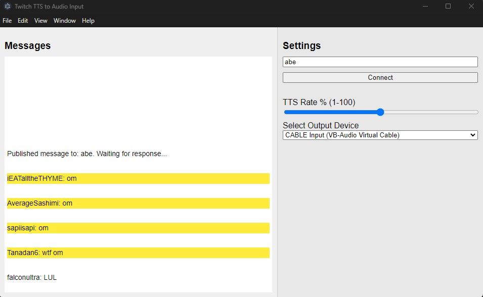
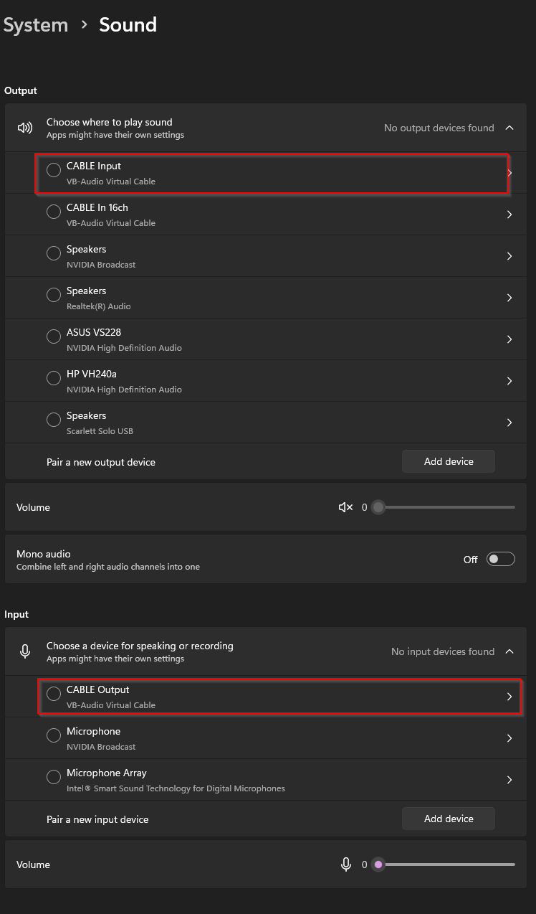
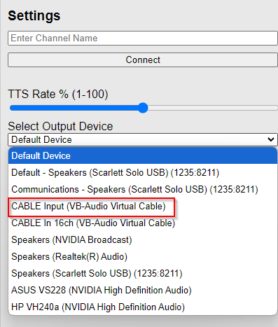

# Twitch Text-to-Speech to Virtual Audio

This application is a simple Electron/nodejs app that listens to a live Twitch channel's chat, turns it into TTS, and routes the audio to a virtual audio device that acts as a working microphone input that you can use for applications and games! 

This app utilizes a separate [backend application](https://github.com/oliverfcarson/twitch-tts-to-audio-back-end) that receives the Twitch Messages and sends them back to the front-end, powered by PubNub.

This app was part of an internal, two working day PubNub Hackathon in 11/2024.



## Features Used
* [PubNub Pub/Sub](https://www.pubnub.com/): Communicates the stream of messages from the Twitch API between the front- and back-end. Can also integrate advanced features in the future, such as presence detection, metadata, moderation and live language translation.
* [tmi.js](https://tmijs.com/): JavaScript Package for Twitch Chat
* [vb-audio software](https://vb-audio.com/Cable/index.htm): Software for being able to utilize virtual audio devices working as virtual audio cable. 

## Installation / Getting Started

* You'll need to download and run the [backend application](https://github.com/oliverfcarson/twitch-tts-to-audio-back-end). Follow the instructions in that readme to run the backend application.
* You need to download the [vb-audio software](https://vb-audio.com/Cable/index.htm) for your operating system. We cannot create virtual audio devices programatically using nodejs libraries (at least on Windows). Once you downlod the zip folder, extract the contents, and follow the README instructions to install. Make sure you restart your computer after installation has finished. Once restarted, check that the virtual audio device is working for *BOTH* output and input. It should look something like this on Windows (System > Sound). They do not need to be set as default for the output/input:

* You'll also need to obtain your free PubNub API Keys. The same keys can be used for both the backend and front end.

### Get Your PubNub Keys

1. You’ll first need to sign up for a [PubNub account](https://admin.pubnub.com/signup/). Once you sign up, you can get your unique PubNub keys from the [PubNub Developer Portal](https://admin.pubnub.com/).

1. Sign in to your [PubNub Dashboard](https://admin.pubnub.com/).

1. Click Apps, then **Create New App**.

1. Give your app a name, and click **Create**.

1. Click your new app to open its settings, then click its keyset.

1. Enable the Stream Controller feature on your keyset (this should be enabled by default after you created the keyset)

1. Copy the Publish and Subscribe keys and paste them into your app as specified in the next step.

## Building and Running

1. Clone the repository

1. Create a .env file in the root directory and add your publish and subscribe keys respectively, in the format:
```
PUBNUB_PUBLISH_KEY= publish_key_here
PUBNUB_SUBSCRIBE_KEY=sub_key_here
```

1. Open the terminal and navigate to the root directory. Run `npm install` to install dependencies.
1. Run the application by entering the command `npm start`.
1. Make sure the back-end application is running.
1. In the dropdown list, make sure you select the VB-Audio Virtual Cable for the CABLE input. This will route the incoming TTS audio to the appropriate virtual microphone.

1. Enter a **live** Twitch channel name in the input box and click Connect. This pulls in the chat anonymously without the need of authenticating via Twitch. Got to twitch.tv and find a channel with a decent number of live viewers to best test the app.
1. After a short period, messages will appear on the left-hand side in real time.
1. Some messages will be spoken outloud (TTS). They will be spoken outloud in the app, as well as routed to the virtual device selected earlier.
1. Messages that are highlighted yellow are messages that were converted to TTS.
1. Use the slider to control the percentage of messages processed for TTS playback (All messages are displayed in the message box, the slider only controls those that are converted to TTS).
1. In another application/game's Audio setting, select the VB-Audio Virtual Cable for the microphone option.

